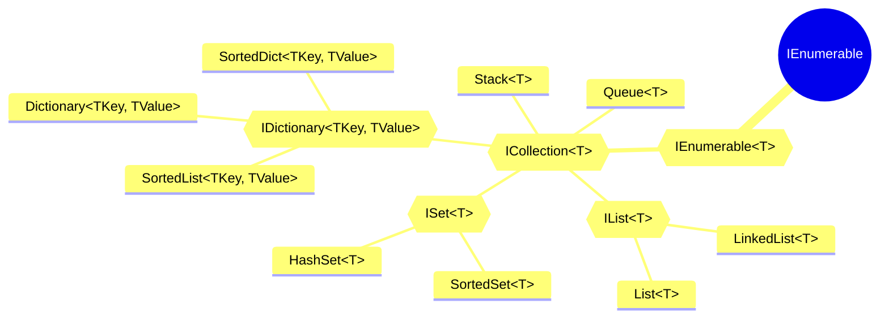

+++

title = "Heap e Priority Queues"
description = "Algoritmi e Strutture Dati"
outputs = ["Reveal"]
aliases = [
    "/guide/"
]

+++

##### Istituto Tecnico Tecnologico "Blaise Pascal" **@** Cesena

{}
# Algoritmi e Strutture Dati
{}

La struttura dati **heap** e i suoi utilizzi. 

 

<small>

A cura di Nicholas Magi — `nicholas.magi[at]ispascalcomandini.it`

</small>

 

{}

---

Overview
## Strutture dati principali in C#

{}

{}

{}

{}
{}

Disclaimer: ce ne sono tante altre!

{}
{}

{}

---

{}
## **Heap**

---

## Scenario: **dati**

- Abbiamo un insieme di $n \in \mathbb{N}$ **chiavi** $S = \\{ k_1, k_2, \dots, k_n \\}$ da memorizzare.

- Per semplicità (e senza perdere di generalità) supponiamo che $$k_i \in \mathbb{N}, \quad \forall i \in \\{ 1, \dots, n \\}$$

---

## Scenario: **operazioni**

Da implementare in un Max(*Min*)-Heap

1. Costruire un Max(*Min*)-Heap
2. Trovare il numero massimo(*minimo*)
3. Estrarre il numero massimo(*minimo*)
4. Inserire una chiave
5. Incrementare(*decrementare*) una chiave

 
 

{}
Questa struttura dati non è progettata per cercare un elemento al suo interno **in maniera efficiente**.
{}

---

## Scenario: **utilizzi**
Qualunque caso in cui abbiamo un insieme di elementi, dove a ciascuno dei quali è assegnata una **priorità**.
- struttura dati necessaria a modellare una **priority queue** efficiente.
  - operazioni di 
    - inserimento in coda (`Enqueue()`)
    - estrazione dalla coda (`Dequeue()`)

### Esempio informatico: **CPU e processi**.

---

## Visualizzazione 

- Per il PC è un **array**.
- Per noi è comodo lavorare con un **albero binario**.

 
 

{}

[visualgo.net](https://visualgo.net/en/heap)

{}

---

## Albero binario - richiamo alla definizione

{}

Un albero (ADG — *Acyclic Directed Graph*) si dice binario quando il numero di figli di ciascun nodo è compreso tra 0 e 2 (inclusi).

{}

 

{}
Un **heap** è un albero binario **completo** in cui possono mancare foglie *consecutive* a partire da *destra*.
{}

---

## Max-(*min*) heap

{}
Sia $x$ un qualsiasi nodo dell'Heap, allora i figli di $x$ contengono tutti chiavi minori o uguali (*maggiori o uguali*) della chiave contenuta in $x$. 
{}

 

Altezza dell'albero:
$$
h = \lceil \log_2(n + 1) \rceil = \Theta(\log(n))
$$

(dove $n$, ricordiamo, è il numero di chiavi da memorizzare)

---

## Utilità - navigazione

Costo di navigazione: $\Theta(1)$

---

### 01. Costruire un Max-Heap / pt. 01

Costo di Max-Heapify: $\Theta(h) = \Theta(\log(n))$

---

### 01. Costruire un Max-Heap / pt. 02

Costo di Build-Max-Heap: $\Theta(n)$

---

### 02. Trovare il numero massimo(*minimo*)

Costo di Heap-Maximum: $\Theta(1)$

---

### 05. Incrementare(*decrementare*) una chiave

Costo di Heap-Increase-Key: $\Theta(h) = \Theta(\log(n))$

---

### 04. Inserire una chiave

Costo di Max-Heap-Insert: $\Theta(h) = \Theta(\log(n))$

---

### 03. Estrarre il numero massimo(*minimo*)

Costo di Heap-Extract-Max: $\Theta(h) = \Theta(\log(n))$

---

## Sintesi dei costi

| Operazione  | Costo | Nota |
|:-------|:-----:|------------:|
| Navigare | $\Theta(1)$  | **Costante** - ottimo!   |
| Costruire    | $\Theta(n)$  | **Lineare** - buono!  |
| Trovare il massimo(*minimo*)  | $\Theta(1)$  | **Costante** - ottimo! |
| Estrarre il massimo(*minimo*)  | $\Theta(\log(n))$  | **Logaritmico** - molto buono! |
| Inserire una chiave  | $\Theta(\log(n))$  |  **Logaritmico** - molto buono!|
| Incrementare(*decrementare*) una chiave  | $\Theta(\log(n))$  | **Logaritmico** - molto buono! |
| Heapsort  | $\Theta(n\cdot\log(n))$  | **Per i più curiosi** - molto buono (nella sua categoria)! |

 

{}
ottimo > molto buono > buono
{}

{}

---

{}

{}
{}

{}

{}
## Priority Queues

Strutture dati che contengono elementi a cui è associata una **chiave numerica**.

Le code a priorità supportano le seguenti operazioni:
- trovare il massimo (*minimo*)
- estrarre il massimo (*minimo*)
- inserire una chiave nella coda
{}

{}

---

{}
{}
### PQ: Implementazione con **vettore disordinato**

1. Trovare il massimo: $\Theta(n)$
2. Estrarre il massimo: $\Theta(n)$
3. Inserire una chiave: $\Theta(1)$
{}

{}
### PQ: Implementazione con **vettore ordinato**
1. Trovare il massimo: $\Theta(1)$
2. Estrarre il massimo: $\Theta(1)$
3. Inserire una chiave: $\Theta(n)$
{}

{}
{}
### PQ: Implementazione con **heap**
{}

1. Trovare il massimo: $\Theta(1)$
2. Estrarre il massimo: $\Theta(\log(n))$
3. Inserire una chiave: $\Theta(\log(n))$

{}

{}

{}

---

## Bibliografia

[1] Appunti (rivisitati) del prof. Luciano Margara, corso di *Algoritmi e Strutture Dati*, LT. Ingegneria e Scienze Informatiche, Università di Bologna — Campus di Cesena.

[2] Collections Generics — [kottans.org](https://kottans.org/csharp-slides/presentations/9-collections-generics/#/15)